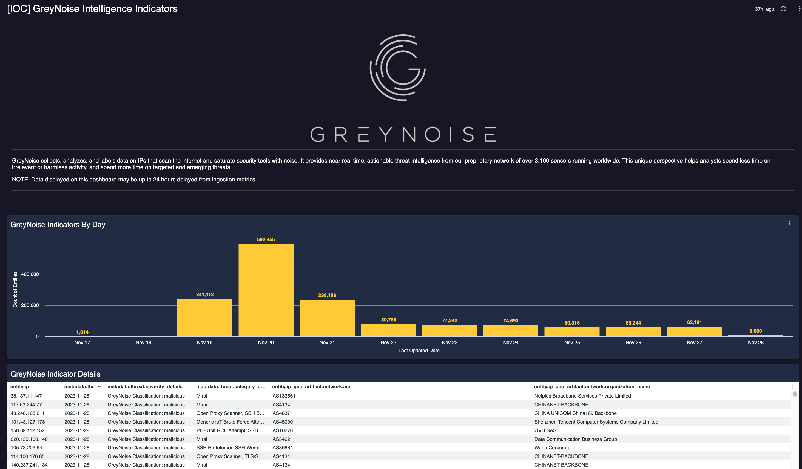
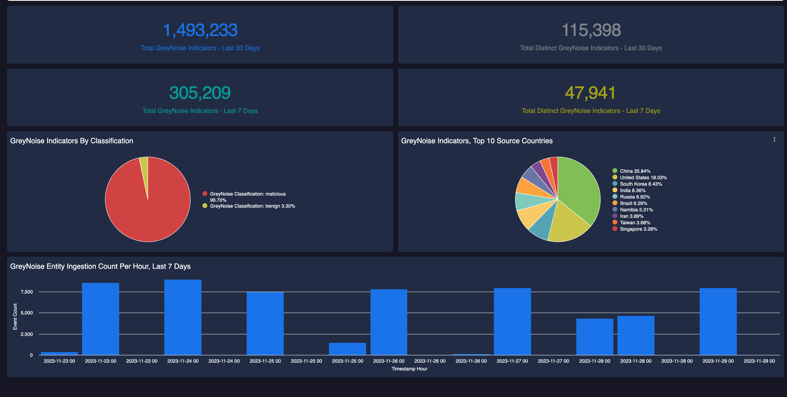

# GreyNoise Chronicle SIEM Integrations

This repo contains integration code to support using GreyNoise Intelligence data within the Google Chronicle SIEM platform.

## Usage 

The integration uses the GNQL API to pull indicators from GreyNoise, then submits them to the Chronicle Ingestion API.

This script is designed to run on a daily cadence and imports the last 24h of active scanners.  A sample query is included in the script by default and queries for both benign and malicious indicators.

`(classification:malicious OR classification:benign) last_seen:1d`

This query can be updated in the script to provide the correct set of indicators to ingest.

The following environment variables need to be set on the host system prior to running the script:

| ENV Name              | Sample Value           | Description                                        |
|-----------------------|------------------------|----------------------------------------------------|
| GN_API_KEY            | `abc1234`              | The GreyNoise API key for the GNQL Endpoint        |
| CHRONICLE_CUSTOMER_ID | `bcas-addd-12323-agef` | The Chronicle Customer ID to send indicators       |
| REGION                | `us`                   | The Region where the Chronicle instance is located |

Additionally, the script looks for the Ingestion API credential file to be located in the same directory as the script and to be named `sa-info.json`

Once all variables and credentials are defined, the script can be executed and will output details on the success or failure of the execution.

It is recommended that this script be set to run once-per-day, typically at 00:30:00 UTC.

## Field Mappings 
The following field mappings are used by default within the integration:

| GreyNoise Field Name    | Chronicle UDM Mapping                             |
|-------------------------|---------------------------------------------------|
| ip                      | entity.ip                                         |
| first_seen              | metadata.threat.first_discovered_time             |
| last_seen               | metadata.threat.last_updated_time                 |
| tags                    | metadata.threat.category_details                  |
| metadata.city           | entity.ip_geo_artifact.location.city              |
| metadata.source_country | entity.ip_geo_artifact.location.country_or_region |
| metadata.asn            | entity.ip_geo_artifact.network.asn                |
| metadata.organization   | entity.ip_geo_artifact.network.organization_name  |
| classification          | metadata.threat.severity_details                  |
| GN Visualizer URL       | metadata.threat.url_back_to_product               |
| metadata.organization   | metadata.                                         |

Fields with Default Values used for all Indicators:

| Chronicle UDM Mapping        | Value                                              |
|------------------------------|----------------------------------------------------|
| metadata.vendor_name         | `GREYNOISE`                                        |
| metadata.product_name        | `GREYNOISE`                                        |
| metadata.collected_timestamp | UTC Date and Time when Indicator is submitted      |
| metadata.product_entity_id   | GreyNoise Generated UUID for Indicator             |
| metadata.interval.start_time | UTC Date and Time when Indicator is submitted      |
| metadata.interval.end_time   | 7 Days in the Future, based on start_time          |
| metadata.entity_type         | `IP_ADDRESS`                                       |
| metadata.threat.category     | `NETWORK_RECON`                                    |
| metadata.threat.summary      | `Internet Scanning activity observed by GreyNoise` |

## Dashboard

The repo also includes a basic dashboard the provides insight into the GreyNoise indicators being ingested into Chronicle.  This file can be imported into the dasbhoard section of Chronicle and should work out of the box.

 
 

 ## Contributing

Please read [CONTRIBUTING.md](CONTRIBUTING.md) for details on our code of conduct, and the process for submitting pull requests to us.

## Versioning

We use [SemVer](http://semver.org/) for versioning. For the versions available, see the [tags on this repository](https://github.com/GreyNoise-Intelligence/greynoise-chronicle-siem/tags).

## Authors

* **Brad Chiappetta** - *Initial work* - [bradchiappetta](https://github.com/bradchiappetta)

See also the list of [contributors](https://github.com/GreyNoise-Intelligence/greynoise-chronicle-siem/contributors) who participated in this project.

## Acknowledgments

* Ian Heritage @ Chronicle for insight and guidance on initial design
* [thatsiemguy](https://github.com/goog-cmmartin/thatsiemguy) for sample patterns used to create the base integration

## Links

* [GreyNoise.io](https://greynoise.io)
* [GreyNoise Terms](https://greynoise.io/terms)
* [GreyNoise Documentation](https://doc.greynoise.io)

## Contact Us

Have any questions or comments about GreyNoise?  Contact us at [hello@greynoise.io](mailto:hello@greynoise.io)

## Copyright and License

Code released under [MIT License](LICENSE).

